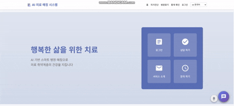
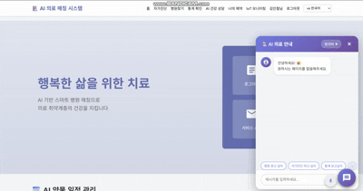
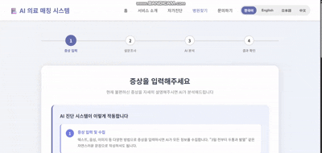
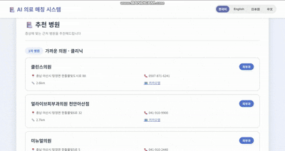
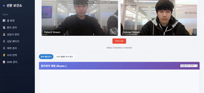

# 프로젝트 명: 메디 브릿지 (MediBridge)
### SPRING AI를 활용하여 의료 취약계층을 위한 공공기관 병원 매칭 관리 및 헬스케어 시스템 

> [!important] 
Spring AI, RAG, WebRTC 및 IoT 기술을 활용하여 의료 취약계층(고령층, 외국인, 장애인)이 언어와 신체적 장벽 없이 의료 서비스를 받을 수 있도록 지원하는 통합 플랫폼입니다.

### 팀원: 김형경 | 문태건 | 이태준 | 신인철 

## 프로젝트 개요

### 기획 의도
고령화 사회와 다문화 사회 진입으로 심화되는 의료 접근성 격차를 해소하기 위해 기획되었습니다. AI 기술과 IoT를 활용하여 대상자가 독립적인 생활을 유지하면서도 예방적 건강 관리와 응급 상황 대응이 가능한 안전망을 구축합니다.

### 개발 필요성 및 목적
- 비대면 AI 진료 및 상담을 통해 거동이 불편한 환자의 의료 접근성 향상
- 증상과 사진을 AI가 분석하여 적절한 진료과 및 병원 추천 (의료 자원 효율화)
- 다국어 지원 및 수어 번역을 통해 언어 및 장애 장벽 없는 의료 서비스 제공
- IoT 기기 연동 및 Vision AI를 통한 능동적인 건강 모니터링 및 복약 관리

## 기술 스택

### Frontend
- HTML5, CSS3, JavaScript
- JSP, JSTL, jQuery
- Bootstrap, Highcharts
- WebRTC, SockJS

### Backend
- Java 17, Spring Boot
- Spring AI, Spring Security
- MyBatis, WebSocket, SSE

### Database
- PostgreSQL (pgvector)

### AI / ML
- OpenAI (GPT-4o, Whisper)
- MediaPipe (Gesture Recognition)

### DevOps
- GitHub, Notion, Figma, Mermaid
- IntelliJ, Canva, VisualParadigm

### External API
- Kakao REST API, Naver Search API
- 공공데이터포털 API

## 시스템 구조

### 시스템 구성도
[이미지]

### 요구사항 정의
[이미지]

### ERD (Entity Relationship Diagram)
[이미지 경로 삽입: ERD]

### WBS (Work Breakdown Structure)
[이미지 경로 삽입: WBS]

## 주요 기능

### 1. RAG 기반 신뢰형 의료 정보 제공
Spring AI와 PostgreSQL 벡터 데이터베이스를 활용하여, 전문 의학 지침서와 환자 개인의 진료 기록을 기반으로 사용자 질문에 대해 검증된 답변을 제공하는 AI 시스템입니다.

### 2. WebRTC 및 멀티모달 AI 소통 환경
상담사와 환자 간 1:1 화상 통화를 지원하며, OpenAI Whisper(STT)와 TTS를 연동한 실시간 다국어 통역, MediaPipe 기반의 수어 인식 기능을 통해 장애나 언어 장벽 없는 소통을 지원합니다.

### 3. IoT 데이터 기반 능동형 케어
IoT 센서로 수집된 바이탈 데이터(혈압, 체온 등)를 실시간 시각화하고, 이상 징후 발생 시 보호자 및 관리자에게 알림을 전송합니다.

### 4. 위치 기반 의료 시설 안내
Kakao Map API를 활용하여 환자의 현재 위치 기반으로 인근 병원, 약국 정보 및 응급실 혼잡도를 시각적으로 안내합니다.

### 5. Vision AI 연동 통합 스케줄링
처방전이나 약 봉투를 촬영하면 OCR 및 AI 분석을 통해 복약 일정을 자동으로 캘린더에 등록합니다. 상담 예약 내역과 통합되어 환자가 건강 일정을 놓치지 않도록 관리합니다.

## 주요 기능 화면
[이미지 또는 gif, 영상]

---
## 페이지 번역

---
## 메인화면 챗봇

---

## 자가진단

---

## 병원찾기

---
## 채팅상담

---
## 페이지 번역

---

## 주요기술? 핵심구성?

## 참고 링크는 정리가 잘되어있으면 맨위에 아니면 밑에 
- [[Notion 문서 링크]](https://www.notion.so/SW-2-29ad38e51f1380d9a062c3084cec6a59?source=copy_link)
- [[유튜브 시연영상 2조 메디 브릿지]](https://youtu.be/H9p4pMnvKjU)
